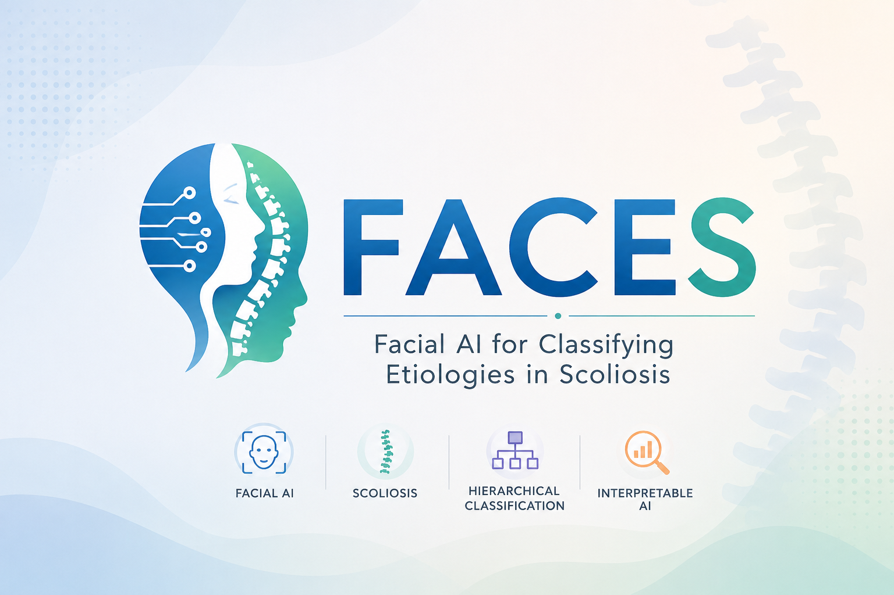

<p align="center">
  
</p>

# SCOLIO-FACES

Facial phenotype-assisted hierarchical screening and etiology stratification for scoliosis research.

This project uses deep learning models to provide hierarchical screening and etiology support ranking for pediatric and adolescent scoliosis. Model outputs are relative support scores and are not standalone diagnostic conclusions.

## Web app and deployment

This repository includes a Gradio web application with the following inference workflow:

1. Binary screening: no scoliosis-related facial phenotype detected versus scoliosis-related facial phenotype detected.
2. If the binary model suggests a scoliosis-related facial phenotype, run etiology superclass stratification across adolescent idiopathic scoliosis, Chiari malformation-associated scoliosis, and syndromic scoliosis.
3. If the downstream workflow is entered, output ranked support across eleven syndromic scoliosis subtype categories.

This application is intended for research demonstration and clinical triage support only. Standard clinical assessment, standing whole-spine radiographs, spine magnetic resonance imaging, genetic testing, and specialist evaluation remain required.

## Option 1: Local installation

```bash
cd /Users/jameswoo/Desktop/FACES
python3 -m venv .venv
source .venv/bin/activate
pip install -r requirements.txt
python app.py
```

Open the local Gradio URL shown in the terminal, usually:

```text
http://127.0.0.1:7860
```

Optional: install `dlib` if 68-point landmark cropping is required in your environment. If `dlib` is unavailable, the app falls back to OpenCV frontal-face detection.

```bash
pip install dlib
```

After dependency installation, run a CPU smoke test:

```bash
python tests/smoke_test.py
```

For hospital intranet deployment, change `server_name` in `app.py` from `127.0.0.1` to the internal host address or `0.0.0.0`, and deploy only behind an approved internal network boundary.

## Option 2: Hugging Face Spaces deployment

Hugging Face Spaces can run the real PyTorch/Gradio inference app.

1. Create a new Space at Hugging Face.
2. Select `Gradio` as the SDK.
3. Upload or push this repository, including:
   - `app.py`
   - `faces_inference/`
   - `requirements.txt`
   - the three `.pth` checkpoint files
   - `logo.png`
4. Wait for the Space build to finish.
5. Test a non-face image first, then a consented frontal face image.

If the push fails because checkpoint files are large, enable Git LFS for `*.pth` before pushing to Hugging Face:

```bash
git lfs install
git lfs track "*.pth"
git add .gitattributes
```

## Option 3: GitHub Pages documentation

GitHub Pages cannot run PyTorch inference. It should be used only as a static project page.

The static documentation page is in:

```text
docs/index.html
```

To publish it:

1. Push the repository to GitHub.
2. Open repository `Settings`.
3. Go to `Pages`.
4. Choose `Deploy from a branch`.
5. Select the branch and `/docs` folder.
6. Save and wait for the Pages URL.

## RShiny note

RShiny is feasible, but it is not used in v1. The model stack is already Python/PyTorch, so a Shiny app would need either `reticulate` to call `faces_inference.predict_faces()` or a separate Shiny UI that calls a Python API. That adds cross-language deployment complexity without improving the first public demo.

## Privacy and data governance

- The app performs single-session inference and does not intentionally save uploaded raw facial images.
- Do not commit raw facial images, individual-level clinical data or patient identifiers to GitHub.
- Facial photographs are identifiable medical data. Use explicit consent, restricted access and local institutional governance before any clinical or external use.
- Public demo deployments should use consented demonstration images only. Avoid uploading patient faces to public services unless institutional approval and consent explicitly cover that use.

## Model files

The current app loads the existing local checkpoints:

- `Binary classification model/best_auc_model_seed64.pth`
- `three-category superclass classification model/best_auc_model_seed53.pth`
- `11-class ResNet50 subtype model/best.pth`

If these files are moved, update `faces_inference/config.py`.
